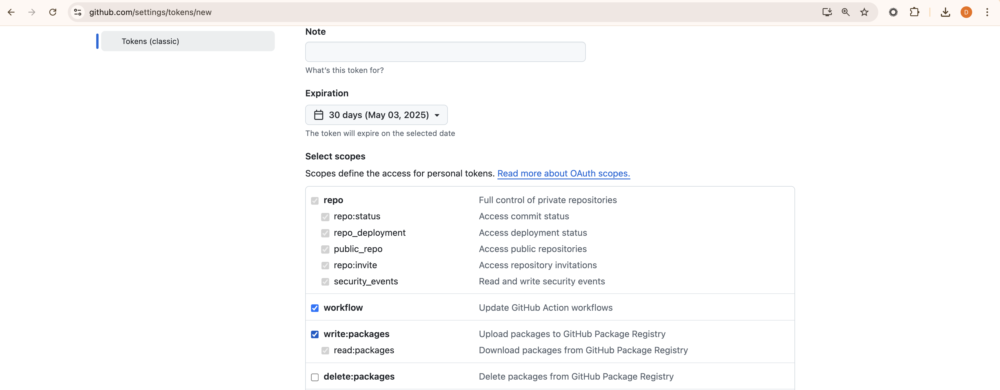

# fetch-secrets
Fetch github secrets of a given repository the github user has write access to.

## Usage

The 'git', 'curl' and 'jq' utilities are required to run this script.
From the root of the cloned github repo run:
```shell
curl -s https://raw.githubusercontent.com/dmitry-workato/fetch-secrets/main/script.sh | bash -s DATABRICKS_PERSONAL_ACCESS_TOKEN
```

The script relies on the [GITHUB_TOKEN](https://github.com/settings/tokens) environment variable to get write access to the github repository
and read access to the github actions of the repository. Here are the required permissions for the token:



It is a good practice always have such a token in your environment to simplify work with the Github.

On successful run the secrets will be stored in local file 'fetch-gha-secrets-unix_time.txt' in ready to "source" by a shell format.
